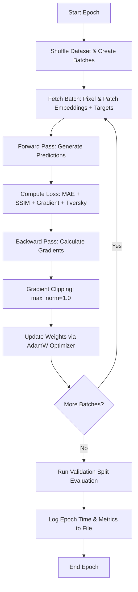
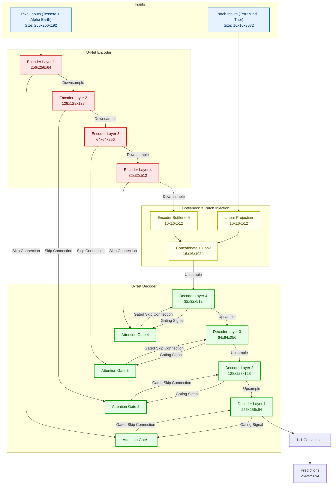

# Attention-Gated Skip Connections: Architecture & Training Epochs

This document explains what happens during a training epoch of our multi-modal fusion model and details the layout of the network architecture.

---

## 1. What Happens During a Training Epoch?

An epoch is one complete pass of the training algorithm through the entire training dataset. For a single epoch, the step-by-step process is as follows:

### Detailed Steps:
1. **Data Shuffling & Batching**: The dataloader shuffles the dataset pairs/triplets to ensure the model does not learn the order of the data. It divides the data into batches (default batch size: `16`).
2. **Forward Pass (Inference)**: 
   * The inputs are loaded: pixel embeddings ($256 \times 256 \times C_{pixel}$) and patch embeddings ($16 \times 16 \times C_{patch}$).
   * The network processes the inputs to generate the 4-channel target prediction ($256 \times 256 \times 4$).
3. **Loss Calculation**: The `ImprovedCompositeLoss` function evaluates the prediction against the ground truth labels:
   * **MAE Loss**: Calculates pixel-wise absolute error for all classes.
   * **SSIM Loss**: Captures structural similarities (edges, contours) for spatial accuracy.
   * **Gradient Loss**: Penalizes discrepancies in image gradients (making edges sharper).
   * **Tversky Loss**: Handles class imbalance (highly effective for segmentation of rare classes).
4. **Backward Pass (Backpropagation)**: PyTorch computes the gradients of the loss with respect to all trainable parameters of the model.
5. **Gradient Clipping**: Restricts the maximum norm of the gradients to `1.0` to prevent gradient explosion and stabilize training.
6. **Optimizer Update**: The `AdamW` optimizer uses the calculated gradients and weight decay to update the network weights.
7. **Validation & Scheduler Step**: After running through all training batches, the model runs a validation pass on unseen validation samples, computes the validation loss, and updates the learning rate scheduler (`ReduceLROnPlateau`).

---

## 2. Schematic Network Drawing

Our architecture uses **Option 2A: Attention-Gated Skip Connections**. High-resolution pixel-level features are fused with patch-level semantic features at the bottleneck, and the decoding phase is attention-guided by the high-resolution encoder features.

### Key Components of the Attention Gate (AG)
Each Attention Gate filters the skip connections from the Encoder:
1. **Inputs**: The high-resolution feature map from the Encoder ($x$) and the gating signal from the coarser Decoder layer ($g$).
2. **Operations**:
   * Compute linear transformations of $x$ and $g$ using $1 \times 1$ convolutions.
   * Add the transformed outputs together and pass through a **ReLU** activation.
   * Apply a $1 \times 1$ convolution followed by a **Sigmoid** activation to calculate the attention coefficients $\alpha \in [0, 1]$.
   * Multiply the original encoder feature map $x$ by $\alpha$.
3. **Outcome**: The decoder only receives high-resolution spatial details in regions where the attention gate is active (e.g. focused on building boundaries), reducing noise and improving spatial delineation.
